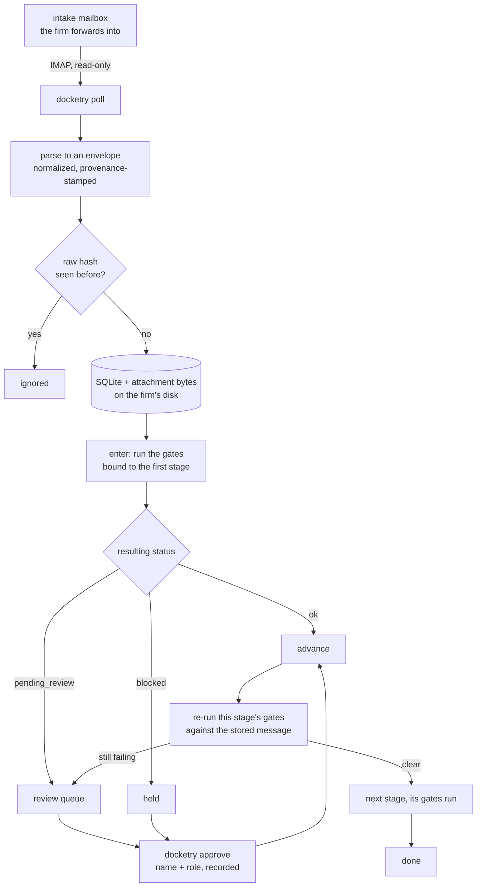
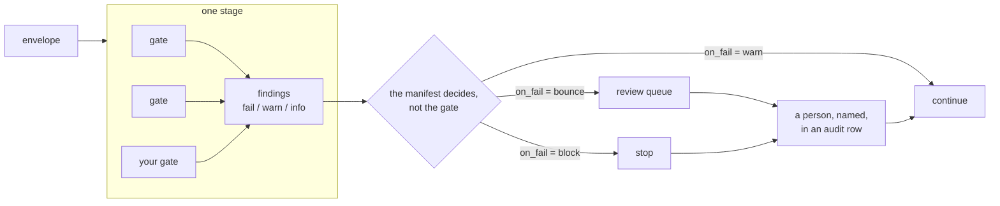
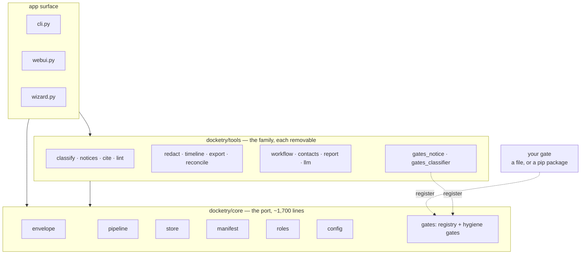
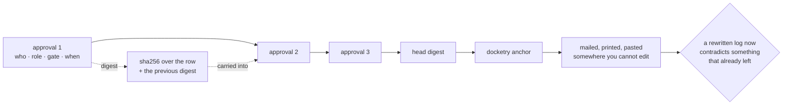

# Architecture

Four diagrams and the reasoning behind each. If you are here to write a gate,
[GATES.md](GATES.md) is the shorter path; this is the shape of the thing your
gate plugs into.

## 1. What happens to a message

Three things this picture is making a point of.

The mailbox arrow only goes one way, and it is read-only: messages are never
marked, moved or deleted, and Docketry never sends. The firm decides what
enters the pipeline by pointing a forwarding rule at it.

`advance()` is the only forward path. There is no advisory mode and no bypass
flag, and an approval does not mark a message released — it records that a
named role approved, and then the gates run *again*. A hold is cleared by the
gates agreeing it is clear, not by a stored status anyone could edit.

Deduplication is on the hash of the raw message, so polling twice, or a
forwarding rule that fires twice, does not create two matters.

## 2. Where a gate sits

A gate reports. It does not decide what its report means, and it cannot
release its own hold — that is a human approval in an audit log. The same gate
is advisory in one firm's manifest and blocking in another's with no change to
its code.

Gates declare which stages they are meant for. Binding one outside that
refuses when the manifest loads, so a misconfiguration surfaces in front of
whoever is configuring it rather than at five o'clock in front of someone who
cannot fix it.

## 3. The package

Every arrow points down. Nothing in `core/` imports from `tools/`, the CLI or
the UI, and `tests/test_boundaries.py` fails the build if that changes — the
claim that this is a base layer is a test, not a paragraph.

The dotted arrows are the extension point, and they are the same arrow. The
notice parser and the document classifier ship with Docketry but live in
`tools/` and register themselves with the port's registry exactly the way a
third-party gate does. If that route were second-class, the shipped gates
would be the ones to notice.

Writing a tool is not special either: import from `core`, do one thing. The
family is a directory of those, not a framework.

## 4. The audit record

Each approval digests its own content together with the digest of the row
before it, so an edited, deleted, reordered or inserted release stops
verifying. `docketry doctor` checks the chain and fails if it is broken.

Read the limit as carefully as the property. The database is on the firm's own
disk with no key, so anyone who can edit a row can recompute every digest
after it and hand you a chain that verifies — `tests/test_chain.py` does
exactly that, deliberately, so nobody mistakes the property for authenticity.
The chain catches the careless edit. The anchor is what makes the deliberate
one need an accomplice: a copy of the head that the editor cannot reach.

## What is deliberately not here

**No login.** The review UI binds to 127.0.0.1 and refuses any other
interface. A role is an attestation recorded against a name, checked against a
declared registry so it catches mistakes. It does not authenticate anyone, and
nothing in the design pretends otherwise.

**No encryption at rest.** An encrypted database whose key sits on the same
disk is comfort, not protection. Full-disk encryption and OS accounts are the
control.

**No model in the enforcement path.** A model may propose, from an endpoint
that must resolve to the firm's own network or the request is refused before
it is built. It never releases a hold, applies a classification, or decides
what to redact.

**Nothing hosted.** There is no server component, no telemetry, and no
outbound anything. `docketry doctor` states plainly whether anything
configured can reach off the network.
