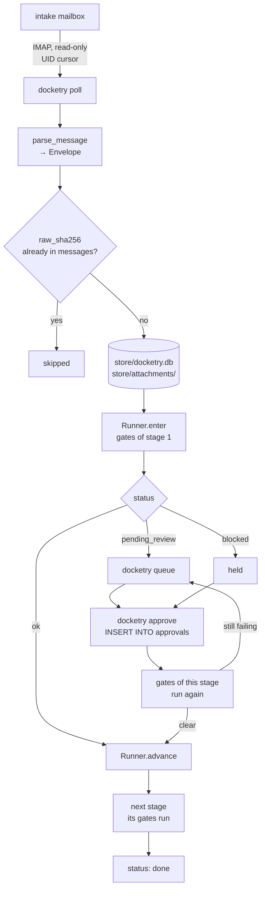
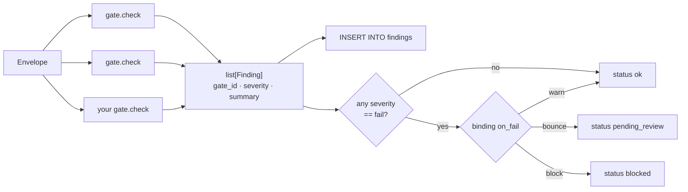
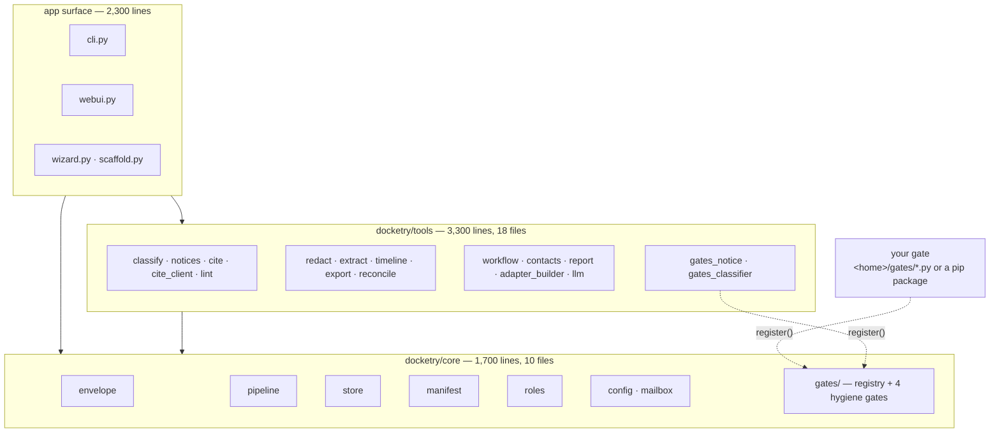
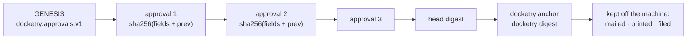

# Architecture

How a message moves, what the package contains, and what is stored where. For
writing a gate, see [GATES.md](GATES.md).

## Message lifecycle

Facts this encodes:

- IMAP access is read-only (`SELECT ... readonly`), and no code path sends mail.
- Ingest is idempotent on `raw_sha256`, so a duplicate forward or a re-poll does
  not create a second message row.
- `Runner.advance()` is the only function that changes a message's stage.
- An approval inserts a row; it does not set a status. The gates for the stage
  are re-run and the message moves only if they pass. Status stored in the
  database is never trusted as evidence a hold cleared.
- Re-runs get the real attachment bytes, read back from
  `store/attachments/` and checked against the SHA-256 recorded at ingest.

## Gate evaluation

Every finding is written to `findings`, including `warn` and `info` ones that
do not hold anything. A stage's status is the strongest outcome across its
gates: `blocked` beats `pending_review` beats `ok`.

A gate reports; the manifest decides what the report means. Releasing a hold is
`docketry approve`, which requires a role the registry says may release that
gate.

## Package layout

| Package | Contains | Depends on |
|---|---|---|
| `core/` | envelope parsing, gate runner, SQLite store, manifest loader, role registry, config, IMAP client, gate registry and the four hygiene gates | nothing above it |
| `tools/` | classification, notice parsing, citations, linting, redaction, extraction, timelines, exports, reconciliation, workflow, contacts, reporting, optional local model | `core/` |
| top level | CLI, review UI, setup wizard, gate scaffold | both |

`tests/test_boundaries.py` parses every module under `core/` and fails the
build if one imports from `tools/`, the CLI or the UI. It also caps `core/` at
12 files and 2,500 lines.

`notice-parser` and `doc-classifier` ship with Docketry but live in `tools/`
and register through the public `register()` call, the same path a third-party
gate uses. If that path broke, those two would stop working.

## Storage

Everything is under the home directory. `store/docketry.db` is SQLite:

| Table | Rows |
|---|---|
| `messages` | one per ingested message: `raw_sha256` (unique), `envelope_json`, `stage`, `status` |
| `attachments` | filename, content type, `sha256`, size, path into `store/attachments/` |
| `findings` | every gate result: message, stage, gate, severity, summary, timestamp |
| `approvals` | who released what: message, stage, gate, name, role, note, timestamp, `prev_sha256`, `sha256` |
| `notices` | parsed e-service: adapter, notice type, extracted fields, missing fields |
| `matters` | case number, type, workflow stage |
| `matter_events` | every stage change, with who moved it |
| `classifications` | document-type proposals and whether a human applied them |
| `imap_state` | per-mailbox UIDVALIDITY and last-seen UID |

Attachment bytes are written to
`store/attachments/<sha256[:2]>/<sha256[:16]>_<filename>`, so identical
attachments across messages are stored once. `config.toml` is created with mode
0600 on POSIX; on Windows the file inherits the directory's ACL, and
`docketry init` says so when a password is stored.

## Approval chain

Each approval row stores a SHA-256 over its own fields — message id, stage,
gate, approver, role, note, timestamp — concatenated with the previous row's
digest. `chain_report()` walks the table and re-derives every digest;
`docketry doctor` fails if one does not match, and `docketry anchor` refuses to
print a head over a chain that does not verify.

What it detects: a row edited, deleted, reordered or inserted in place.

What it does not: authenticity. The database has no key and sits on the same
disk as everything else, so anyone who can write to it can recompute every
digest after the row they changed. `tests/test_chain.py` performs that rewrite
and asserts the result verifies. Detecting it requires comparing against a head
that left the machine earlier.

Approvals written before v0.16 have `NULL` digests. They are counted as
unchained rather than back-filled, since a chain computed afterwards over rows
nobody was protecting would be indistinguishable from one that was there all
along.

## Deliberate omissions

| Not present | Instead |
|---|---|
| Login / user accounts | roles are attestations recorded against a typed name, validated against `roles.toml` |
| Encryption at rest | file permissions plus full-disk encryption; a key on the same disk adds nothing |
| A model in the enforcement path | models propose; gates, releases and redaction decisions stay deterministic and human-gated |
| Any hosted component | no server, no telemetry; `doctor` reports whether anything configured can reach off-network |
| Outbound mail | Docketry reads the intake mailbox and never sends |
