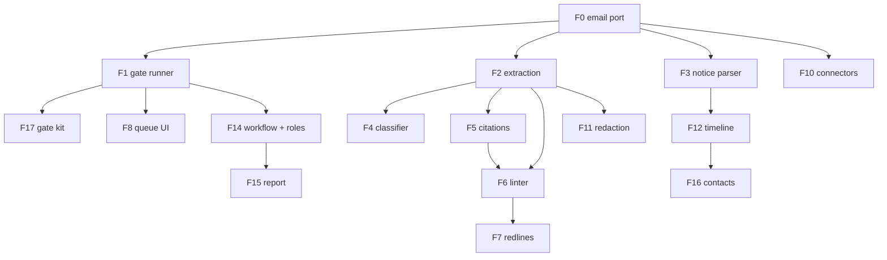

# Features

What is built, what it depends on, and what is not built yet. Version numbers
are the release the feature first shipped in.

Every feature is either `docketry/core/` (the port) or `docketry/tools/` (one
module, removable without touching the port). Optional third-party libraries
are always extras; the core is stdlib-only.

## Status

| # | Feature | Ships in | Module | Extras needed |
|---|---|---|---|---|
| F0 | Email port | v0.1 | `core/` | — |
| F1 | Gate runner + manifest | v0.1 | `core/pipeline`, `core/manifest` | — |
| F2 | Text extraction | v0.3 | `tools/extract` | `pdf`, `ocr`, `docx` |
| F3 | Court-notice parser *(gate)* | v0.2 | `tools/notices` | — |
| F4 | Document classifier *(gate)* | v0.6 | `tools/classify` | needs F2 |
| F5 | Citation verifier | v0.4 | `tools/cite` | `cite` |
| F6 | Brief linter | v0.5 | `tools/lint` | `docx` |
| F7 | Redline emitter | not built | — | — |
| F8 | Review queue UI | v0.8 | `webui.py` | — |
| F9 | Skills starter pack | v0.7 | `skills/` | — |
| F10 | Provider connectors | not built | — | — |
| F11 | Redaction | v0.9 | `tools/redact` | `pdf`, `ocr` |
| F12 | Timeline + docket reconcile | v0.10 | `tools/timeline`, `tools/reconcile` | `export` |
| F13 | Bring your own model | v0.11 | `tools/llm` | — |
| F14 | Workflow engine + roles | v0.13 | `tools/workflow`, `core/roles` | — |
| F15 | Pipeline health report | v0.14 | `tools/report` | — |
| F16 | Contacts directory | v0.15 | `tools/contacts` | — |
| F17 | Gate authoring kit | v0.17 | `core/gates`, `scaffold.py` | — |

Scope rules for all of them: nothing hosted, no cybersecurity claims, no claim
that any rule or citation is current, Apache-2.0.

## Dependency graph

---

## Shipped

### F0 — Email port · v0.1 · `core/`

Reads one IMAP mailbox, read-only, tracking position by UIDVALIDITY and last
UID. Normalizes each message to an `Envelope` (addresses, subject, text body,
threading headers, attachments with SHA-256). Stores messages in SQLite and
attachment bytes in a content-addressed directory. Deduplicates on the raw
message hash.

Since v0.16, `docketry init` asks nine questions and writes `config.toml`,
`guardrails.toml` and `roles.toml`, validating both in memory before writing.

Dependencies: none.

### F1 — Gate runner + guardrail manifest · v0.1 · `core/`

Stages, gate bindings, `block` / `bounce` / `warn`, role-scoped approvals, and
an audit trail. The manifest is validated at load: unknown gates, unknown
stages, a gate bound outside its `allowed_stages`, and bad `on_fail` values all
refuse to load.

Since v0.16 approvals are hash-chained — each row digests its own fields plus
the previous row's digest — and `docketry anchor` prints the head. The chain
detects a row edited, deleted, reordered or inserted in place. It does not
prove authenticity: anyone who can write to the database can recompute the
digests, which `tests/test_chain.py` demonstrates deliberately.

Dependencies: F0. Stdlib `tomllib`.

### F2 — Text extraction · v0.3 · `tools/extract`

One interface: attachment in, text plus page map out. Native PDF text, OCR
fallback for scans, DOCX text. Reports per-page confidence and fails loudly
rather than returning partial text silently, since everything downstream
inherits its errors.

Extras: `pdf` (`pypdf`), `ocr` (Tesseract binary + `pytesseract` + `Pillow`),
`docx` (`python-docx`).

### F3 — Court-notice parser *(gate)* · v0.2 · `tools/notices`

Adapter registry over court notification mail. Built-in adapters:
`fl-eportal-service` (Florida ePortal), `pacer-nef` (federal CM/ECF; the
one-time free-look link is captured as data, never fetched), `jacs-hearing`,
`jaws-hearing`, `efile-receipt` (Tyler). Firm adapters go in `adapters.toml`
and are consulted before built-ins, so a local court's format can be added or
an existing one overridden without code.

Since v0.12 an adapter can be built without writing regular expressions: the
review UI's Court adapters panel takes a pasted notice, finds its labelled
fields, shows what it would capture, and saves only after the real parser
succeeds against that message.

Three notice types: `service_notice`, `filing_receipt`, `hearing_notice`. Any
matched notice missing a required field bounces to the review queue, so
template drift is visible rather than silent.

Works on the email body; does not need F2. Dependencies: F0.

### F4 — Document classifier *(gate)* · v0.6 · `tools/classify`

Types an attachment from title and text anchors — motion, order, notice,
discovery, correspondence. Deterministic. Every write is staged for approval
and fill-only: a classification is applied by `class-apply` with a named
approver, and never overwrites an existing value.

Dependencies: F2.

### F5 — Citation verifier · v0.4 · `tools/cite`

Extracts citations from a draft and checks against CourtListener that the case
exists, the case name matches the reporter cite, quoted language appears in the
opinion, and pin cites resolve. Reports mismatches; never asserts anything is
good law.

Needs `COURTLISTENER_TOKEN` (free account) for lookups. Without it, or offline,
it runs extraction-only, says so, and exits 2 rather than passing silently.

Extra: `cite` (`eyecite` with `reporters-db`/`courts-db`, `httpx`).

### F6 — Brief linter · v0.5 · `tools/lint`

Deterministic checks on litigation drafts: credibility language in
summary-judgment briefing, assertions about sworn testimony with no record pin
cite on the line, internal date contradictions, citation format. Rules live in
a TOML rulepack (`examples/lint-rules.toml`).

Dependencies: F2; shares F5's citation extraction when present.
Extra: `docx`.

### F8 — Review queue UI · v0.8 · `webui.py`

The queue and approve flow in a browser, bound to 127.0.0.1 and refusing any
other address. Same store and same code path as the CLI — approvals go through
the same authorization check, so the UI is not a way around a gate. Includes
the Court adapters panel (F3) and the classification queue (F4).

Dependencies: F1. Stdlib `http.server`.

### F9 — Skills starter pack · v0.7 · `skills/`

Nine agent skills wrapping the CLI, each with an eval suite in
`claude plugin eval` format. A test fails the build if a skill ships without
evals. Skills drive the same commands the pipeline uses; none can release a
hold or apply a classification without a named human.

Dependencies: F4, F5, F6.

### F11 — Redaction · v0.9 · `tools/redact`

Removes text rather than covering it, and keeps the page searchable. Pages
carrying a redaction are rasterised with the areas blanked, OCR'd to rebuild an
invisible text layer, and given a vector overlay: opaque bars, translucent
highlights, and a `[REDACTED]` marker that is real text, so an extractor
reports a redaction rather than a gap. Pages with no redaction keep their
original vector text; highlight-only pages are never rasterised.

`redact-scan` previews and writes nothing. `redact-apply` writes a copy, re-reads
it, reports any term still extractable and exits non-zero. Zero-area boxes are
refused rather than clamped, since they would draw nothing but still cost the
page its text layer.

Dependencies: F2. Extras: `pdf`, `ocr`.

### F12 — Timeline + docket reconciliation · v0.10 · `tools/timeline`, `tools/reconcile`

Weaves notices, receipts and correspondence for one case into a chronology in
four layers that never merge: record, correspondence, client, derived. Notices
match on the case number they carry; correspondence joins a case only when a
human attaches it. Each entry states what the firm holds — the document, a
captured link, or nothing.

Gaps are split into proven (a hole in a federal document-number sequence,
collapsed into runs) and suspected; where there is no sequence, none is
asserted. `docket-reconcile` diffs the reconstruction against a docket a person
pulled, both directions, staging fuzzy matches for confirmation. Nothing is
ever fetched from a court system. Word and Excel exports carry a
not-the-court's-docket disclaimer on their face.

Dependencies: F0, F3. Extra: `export`.

### F13 — Bring your own model (local only) · v0.11 · `tools/llm`

Optional `[llm]` block pointing at a model the firm runs. The hostname is
resolved and every returned address checked before a request is built; unless
all are loopback, private-range or link-local, the request is refused. The
vetted address is the one dialled, and 3xx responses are refused rather than
followed.

Speaks the OpenAI-compatible chat API, so Ollama, llama.cpp, vLLM and LM Studio
work through one code path, and the model name is a config string rather than
an adapter. Reasoning models' `<think>` blocks and `reasoning_content` are
split off the answer; a response containing only reasoning is an error, not an
empty answer. Every proposal carries its endpoint, model name and prompt hash.

A model proposes. Nothing in this module releases a hold, approves, classifies
or decides what to redact; a test asserts gates, the runner and the redaction
path do not import it.

Docketry ships no weights and endorses no model. Licences differ per release
and are the firm's to check.

Dependencies: F1 (config). Stdlib `urllib`/`http.client`; no provider SDK.

### F14 — Workflow engine + role registry · v0.13 · `tools/workflow`, `core/roles`

Matters move through stages the way messages move through the pipeline: a
transition declares what must be true before it opens, and a matter that does
not meet it holds and says why in words. Conditions read the existing record — a
classified document, a received notice, a filled field. Every stage change
records who made it; an unattributed move is refused. `workflow-check` walks a
hypothetical matter without touching the database.

This is not case management: no billing, trust accounting, client portal or
calendar. `examples/workflow-generic.toml` is a bare skeleton meant to be
rewritten, and a test asserts it names no practice, party or strategy.

`roles.toml` declares who may release what, validated when config loads.
`may_release` lets a senior role clear a hold marked for a junior one. There is
no login, so a role is an attestation recorded against a typed name: it catches
mistakes, not lies.

Dependencies: F0, F1.

### F15 — Pipeline health report · v0.14 · `tools/report`

Volume by sender domain (split internal/external once `[firm] domains` is set),
how long each gate held things (median and slowest tenth rather than a mean),
and what did the holding.

One-way mail is counted apart from conversations, so e-service and calendaring
volume does not bury the messages someone must answer. A source counts as
one-way from its headers (`Auto-Submitted`, `Precedence`, `List-Id`, captured at
ingest because they cannot be recovered later), from an adapter recognising it
as a court notice, or from a noreply address.

Two specific rots it looks for: a gate configured for months that has never
fired, and an adapter that matched notices last month and none since, which
usually means that court changed its template. It also counts documents named
in a notice with a link but no copy, and matters that have not moved.

It does not measure people and cannot: the only names in the store are
free-text strings typed at approval, where three spellings are three people.
Approvals are counted by role, turnaround by gate, and a test asserts no
approver name reaches the report.

Dependencies: F0, F1, F14.

### F16 — Contacts directory · v0.15 · `tools/contacts`

`contacts.toml` says who an address belongs to, keyed by email — an address is
unique, comparable, and already on every message. A leading `@` claims a whole
domain.

Two axes are kept apart: KIND is what a contact is to the firm (staff, client,
opposing counsel, court, expert, vendor); ROLES are what a staff member may
release and must name a role declared in `roles.toml`. An opposing-counsel
entry carrying a role is refused.

This fills the timeline's `client` layer, which was previously always empty
because nothing knew which addresses belonged to the client. Optional; without
it everything falls to the correspondence layer.

Dependencies: F12, F14, F15.

### F17 — Gate authoring kit · v0.17 · `core/gates`, `scaffold.py`

`new-gate` writes a working gate into `<home>/gates/`; `try-gate` runs one gate
against one message with no mailbox, pipeline or store; `gates` lists what is
bindable and where each came from. Gates load from the home directory or from
an installed package's `docketry.gates` entry point. A file that fails to load,
or registers nothing, stops the command rather than being skipped, and a
duplicate gate id is refused rather than overwriting.

[GATES.md](GATES.md) is the walkthrough; `tests/test_first_gate.py` executes it
and checks that every command it shows is one the CLI accepts.

Before this, the registry was populated only by imports inside the package, so
a third-party gate required editing Docketry's source. The two gates that ship
from `tools/` now use the same entry route, so it cannot break unnoticed.

Dependencies: F1.

---

## Not built

### F7 — Redline emitter

Turn accepted lint findings into native Word tracked changes.

Dependencies: F6. Would need `python-redlines` or `adeu`, both wrapping a .NET
comparison engine — the heaviest dependency anything here would take, so it
belongs behind an interface that can be swapped.

### F10 — Provider connectors

Narrow API connectors (Microsoft Graph, Gmail API) for firms that outgrow
forwarding, with bring-your-own OAuth app and per-mailbox scoping. Same
envelope contract as F0, so nothing downstream changes.

Dependencies: F0. Would need `msal` or the Google API client, each an extra.

## Build order

F0/F1 → F3 → F2 → F5 → F6 → F4 → F9 → F8 → F11 → F12 → F13 → F14 → F15 → F16
→ F17 → F7 → F10.

F3 came before F2 because it needs only the email body and exercises the gate
interface end to end. F5 came before F6 because the linter reuses the
verifier's citation extraction.
