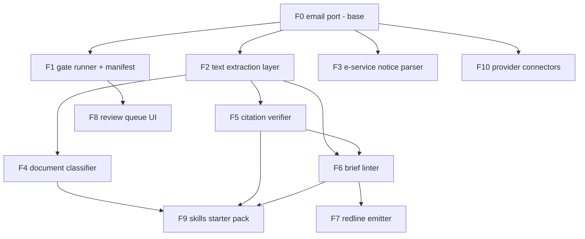

# Feature manifest

The roadmap as a dependency graph. **Internal** dependencies are other
features in this family; **external** dependencies are third-party libraries
or binaries, always declared as optional extras so the core stays
stdlib-only. A feature marked *(gate)* ships as a gate implementation that a
`guardrails.toml` can bind.

Scope rules that bind every feature: local-first (nothing hosted by us), no
cybersecurity claims, no currency claims (nothing that promises rules or law
are up to date), Apache-2.0.

Where the code lives follows the graph. F0 and F1 — the port and the gate
runner — are `docketry/core/`, which imports nothing above itself. Every
other feature here is a module in `docketry/tools/`, removable without
touching the port; the ones marked *(gate)* register with the port's gate
registry the same way a third-party gate would. `tests/test_boundaries.py`
enforces the direction, so a feature that grows a dependency the wrong way
fails the build rather than quietly making this document wrong.

## Graph

## Features

### F0 — Email port (base) — SHIPPED v0.1
Drains a dedicated intake mailbox over IMAP (read-only, UID cursor),
normalizes each message to a provenance-stamped envelope, stores everything
in SQLite on local disk. Lives in `docketry/core/`, which imports nothing
above itself. Since v0.16, `docketry init` asks for what it needs and writes
config.toml, guardrails.toml and roles.toml from the answers, so no firm has
to author TOML to install this.
- Internal: none.
- External: none (stdlib).

### F1 — Gate runner + guardrail manifest — SHIPPED v0.1
Stages, gates, block/bounce/warn, role-scoped approvals, audit trail,
load-time validation incl. allowed-stages scoping. Since v0.16 the approval
log is hash-chained — each row digests its own content and the row before it,
so an edit, deletion or reordering stops verifying — and `docketry anchor`
prints the head to keep off the machine, which is the half that makes the
chain worth anything. The chain detects tampering; it does not prevent it,
and the README says so in those words.
- Internal: F0 (envelope, store).
- External: none (stdlib `tomllib`).

### F2 — Text extraction layer — SHIPPED v0.3
One interface: attachment in, text + page map out. PDF text natively; OCR
fallback for scans; DOCX text.
- Internal: F0 (attachment store).
- External: `pypdf` (extra `pdf`); **Tesseract binary** + `pytesseract`,
  `Pillow` (extra `ocr`); `python-docx` (extra `docx`). OCR quality drives
  everything downstream, so the extractor must report per-page confidence and
  fail loudly rather than emit garbage silently.

### F3 — Court-notice parser *(gate)* — SHIPPED v0.2
Source-adapter registry over court notification emails: built-in adapters for
the Florida ePortal (service), PACER/CM-ECF NEFs (federal service; the
one-time "free look" link is captured as data, never fetched), JACS and JAWS
hearing notices, and Tyler e-filing receipts — plus firm-defined adapters as
TOML config (`adapters.toml`, consulted before built-ins) so any local
court's format can be added or overridden without code — and since v0.12 that
no longer means authoring regular expressions: the review UI's **Court
adapters** panel takes a pasted notice email, finds its labelled fields, shows
the value it would capture from that message, and saves only after the real
parser succeeds against it. Common schema across
a three-type taxonomy: service_notice / filing_receipt / hearing_notice.
Format parsing only; a matched notice missing a required field bounces to the
review queue — template drift fails loudly, never silently.
- Internal: F0 (envelope). Does **not** need F2 (works on the email body).
- External: none.

### F4 — Document classifier — SHIPPED v0.6
Types an attachment (motion / order / notice / discovery / correspondence…)
deterministically (title + text anchors). All downstream writes are
stage-for-approval, fill-only.
- Internal: F2 (needs text).
- External: none for the deterministic tier. An optional LLM tier would add a
  model API dependency — off by default, bring-your-own key, never required.

### F5 — Citation verifier — SHIPPED v0.4 (CLI; gate lands with F8's draft flow)
The "lint for briefs" existence+name+quote+pin check: extracts citations from
a draft, verifies against CourtListener that the case exists, the case name
matches the reporter cite, quoted language appears in the opinion, and pin
cites resolve. Reports mismatches; never asserts anything is good law.
- Internal: F2 (draft text from DOCX/PDF).
- External: `eyecite` (+ its `reporters-db`/`courts-db` data), `httpx`;
  network access to the CourtListener API — which now requires a (free)
  account token for citation-lookup, via COURTLISTENER_TOKEN. Degraded
  offline/no-token mode = extraction-only with a loud notice, exit code 2,
  never a silent pass.

### F6 — Brief linter — SHIPPED v0.5 (CLI; gate lands with F8's draft flow)
Deterministic writing checks for litigation drafts: credibility-language in
summary-judgment briefing, sworn-testimony assertions lacking a record
pin-cite on the line, internal date contradictions, citation-format lint.
- Internal: F2 (DOCX); F5 optional (shares citation extraction when present).
- External: `python-docx` (extra `docx`).

### F7 — Redline emitter
Turns accepted lint/edit findings into native Word tracked changes.
- Internal: F6.
- External: `python-redlines` or `adeu` (both wrap a .NET comparison engine —
  heaviest external dependency in the family; isolate behind an interface so
  it can be swapped).

### F8 — Review queue UI — SHIPPED v0.8
A small local web view of the queue/approve flow the CLI already provides.
Same store, same endpoints-of-record — never a parallel path around the gates.
- Internal: F1.
- External: none planned (stdlib `http.server` tier) — revisit only if real
  usage demands more.

### F9 — Skills starter pack — SHIPPED v0.7
Light agent skills wrapping the tools: review-my-draft (F5+F6),
classify-this (F4), plus 2–3 example manifests. Skills call the same gates as
the pipeline — never a prompt-only parallel path.
- Internal: F4, F5, F6.
- External: none beyond what those features already declare.

### F11 — Redaction + highlight — SHIPPED v0.9
Removes text rather than covering it, and keeps the page searchable. Pages
carrying a redaction are rasterised with the redacted areas blanked, OCR'd to
rebuild an invisible text layer, and given a vector overlay: opaque bars,
translucent highlights, and a `[REDACTED]` marker that is real text — so an
extractor reports a redaction instead of a silent gap. Pages with no redaction
keep their original vector text; highlight-only pages are never rasterised.
`redact-scan` previews and writes nothing; `redact-apply` writes a copy and
then re-reads it, reporting any term still extractable and exiting non-zero.
Degenerate boxes are refused, not clamped — a zero-area box draws nothing but
would still cost the page its text layer.
- Internal: F2 (the same OCR path and extractor, reused for verification).
- External: none beyond F2's `pdf` and `ocr` extras — `pypdf`, plus the
  Tesseract binary, `pytesseract` and `Pillow`. The overlay is hand-built
  rather than pulling in a PDF drawing library.

### F12 — Case timeline + docket reconciliation — SHIPPED v0.10
Weaves the notices, receipts and correspondence for one case into a single
chronology, in four layers that never merge: record (served/filed/court
events), correspondence, client, and derived (our own inferences). Notices
match on the case number they carry; correspondence is never guessed into a
case — a thread joins only when a human attaches it. Each entry says what the
firm actually holds: the document, a captured link, or nothing. Gaps are split
into proven (a hole in a federal document-number sequence, collapsed into
runs) and suspected; where there is no sequence the tool asserts nothing and
says so. `docket-reconcile` diffs the reconstruction against a docket a person
pulled — both directions, with fuzzy matches staged for confirmation and
nothing ever fetched from a court system. Exports to a real Word table and to
Excel with filters and real date cells; both carry the not-the-court's-docket
disclaimer on their own face.
- Internal: F0 (envelope, now capturing In-Reply-To/References for threading),
  F3 (the parsed notices this is built from).
- External: `openpyxl` and `python-docx` (extra `export`); the core weave and
  the reconciliation are stdlib.

### F13 — Bring your own model (local only) — SHIPPED v0.11
An optional `[llm]` block pointing at a model the firm runs itself. The
endpoint is validated before any request is built and refused unless it
resolves entirely to loopback or private-range addresses — "local only" is a
check, not a paragraph in the README, and a hostname that resolves to both a
private and a public address is refused too. `doctor` and `llm-check` state
plainly whether anything can reach off the network. Speaks the
OpenAI-compatible chat API, so Ollama, llama.cpp, vLLM and LM Studio all work
through one code path. A model PROPOSES: nothing here releases a hold,
approves, classifies, or decides what to redact, and a grep-enforced test
keeps models out of the gates, the pipeline runner and the redaction path.
Every proposal carries its endpoint, model name and prompt hash.
Any model the server can load works without a code change: Qwen, DeepSeek,
Gemma, Llama, Mistral — the model name is a config string, not an adapter.
Reasoning models are handled rather than mangled: `<think>` blocks and a
`reasoning_content` field are both split off the answer and kept separately,
because a model's narration pasted into a case file reads as its conclusion,
and a response that is ALL reasoning is an error rather than an empty answer.

Docketry ships no weights and endorses no model. Licences differ and are the
firm's to check — DeepSeek-R1 is MIT and most Qwen releases are Apache-2.0,
while Gemma is open-weight under Google's own terms rather than an OSI licence,
and terms change between releases.
- Internal: F1 (config); consumers to be decided feature by feature.
- External: none — stdlib `urllib`. No provider SDK, no new dependency.

### F14 — Workflow engine + role registry — SHIPPED v0.13
Matters move through stages the same way messages move through the pipeline:
a transition declares what must be true before it opens, and a matter that
does not meet it holds and says why in words rather than rule names.
Conditions read the record already there (a classified document, a received
notice, a filled field). Every stage change is recorded with who made it, and
an unattributed move is refused outright. The engine touches no database —
`workflow-check` walks a hypothetical matter and shows where it holds, so a
workflow can be tried before it is saved.

This is NOT case management. There is no billing, no trust accounting, no
client portal and no calendar, and there should not be: that ground belongs to
the practice-management system the firm already pays for.

Docketry ships no workflow of its own. `examples/workflow-generic.toml` is a
bare intake/open/active/closed skeleton meant to be rewritten; a test asserts
the shipped file mentions no practice, party or strategy at all. Per matter
type, workflows live at `workflows/<type>.toml` — the same config idiom as
adapters, lint rules and guardrails.

`roles.toml` (optional) declares who may release what, checked when config
loads rather than when someone needs it. It also lets seniority work: without
a registry, clearing compared two strings, so an attorney could not release a
hold marked for a paralegal. Read the limit plainly — Docketry has no login,
so a role is an attestation recorded against a name. It catches mistakes, not
lies, and the docs say so.
- Internal: F0 (store), F1 (gates and approvals share the registry).
- External: none — stdlib `tomllib`.

### F15 — Pipeline health report — SHIPPED v0.14
Where the volume came from (by sender domain, split internal/external once
`[firm] domains` is set), how long each GATE held things (median and slowest
tenth, not a mean that hides the bad days), and what actually held them up.

Announcements and conversations are counted apart. E-service notices, NEFs and
court calendaring mail are one-way: nobody replies to them, so nothing
conversational is measured against them and their volume does not bury the
handful of messages someone actually has to answer. A source is one-way when it
says so in its headers (Auto-Submitted, Precedence, List-Id, captured at ingest
because they cannot be recovered later), when an adapter recognised its mail as
a court notice, or when the address is a noreply.

Its real value is the two kinds of rot nobody notices by hand: a gate that has
been configured for months and has never once fired, and an adapter that
matched forty notices last month and none since — which means that court
changed its template. It also counts documents named in a notice with a link
and no copy, and matters that have not moved.

It does NOT measure people, and cannot honestly: Docketry has no login, so the
only names it holds are free-text strings typed into an approval, where three
spellings are three people and anyone can type anyone. Approvals are counted by
role and turnaround by gate. A test asserts no approver's name reaches the
report.
- Internal: F0 (store), F1 (gate list), F14 (matters).
- External: none.

### F16 — Contacts directory — SHIPPED v0.15
`contacts.toml` says who an address belongs to. Two axes kept apart: a
contact's KIND is what they are to the firm (staff, client, opposing counsel,
court, expert, vendor), while ROLES are what a staff member may release and
must name a role declared in roles.toml — an opposing-counsel entry with a
role is refused, because collapsing the two would make the other side the sort
of thing that can clear a hold.

Keyed by email, not by name: an address is unique, comparable and already on
every message. A leading `@` claims a whole domain, which is how a firm says
"everyone there is the other side" without listing them.

This is what the timeline was missing. It has always declared a `client`
layer, described it as privileged, and never put anything in it, because
nothing knew which addresses belonged to the client — a layer that is always
empty is worse than no layer, since somebody filters by it, sees nothing, and
concludes there was no client communication. With a directory, client mail
lands in its own layer and the report groups correspondence by who wrote it.

Optional. Without it everything falls to correspondence, which is the safe
direction: the mistake that matters is privileged mail sitting in a list
somebody hands over.
- Internal: F12 (timeline layers), F14 (roles), F15 (report).
- External: none — stdlib `tomllib`.

### F17 — Gate authoring kit — SHIPPED v0.17
The extension point, made usable by someone who has not read this repository.
`docketry new-gate` writes a working gate into `<home>/gates/`; `try-gate`
runs one gate against one message with no mailbox, pipeline or store involved;
`gates` lists what is bindable and where each came from. Gates load from the
home directory or from an installed package's `docketry.gates` entry point,
and a file that fails to load stops the command rather than being skipped —
a gate the operator believes is running and is not is worse than no gate.
GATES.md is the five-minute walkthrough, and tests/test_first_gate.py runs it,
so the tutorial cannot drift from the tool.

This is deliberately not a capability feature. If the primitive is good, a
stranger's gate should be indistinguishable from a shipped one; the two gates
that ship from `tools/` take exactly this route to prove it.
- Internal: F1 (the gate protocol and the registry).
- External: none (stdlib).

### F10 — Provider connectors (phase 3)
Optional narrow API connectors (Microsoft Graph, Gmail API) for firms that
outgrow forwarding; bring-your-own OAuth app, per-mailbox scoping.
- Internal: F0 (same envelope contract).
- External: `msal` / Google API client, per connector; each an extra.

## Build order

F0/F1 (shipped) -> F3 (no new deps, immediately useful) -> F2 -> F5 -> F6 ->
F4 -> F9 -> F8 -> F11 -> F12 -> F13 -> F14 -> F15 -> F16 -> F7 -> F10.

F3 before F2 because it needs nothing but the envelope and proves the
gate-plugin story end to end; F5 before F6 because the linter borrows the
verifier's citation extraction.
