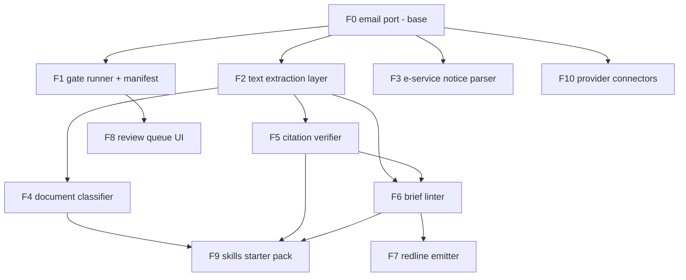

# Feature manifest

The roadmap as a dependency graph. **Internal** dependencies are other
features in this family; **external** dependencies are third-party libraries
or binaries, always declared as optional extras so the core stays
stdlib-only. A feature marked *(gate)* ships as a gate implementation that a
`guardrails.toml` can bind.

Scope rules that bind every feature: local-first (nothing hosted by us), no
cybersecurity claims, no currency claims (nothing that promises rules or law
are up to date), Apache-2.0.

## Graph

## Features

### F0 — Email port (base) — SHIPPED v0.1
Drains a dedicated intake mailbox over IMAP (read-only, UID cursor),
normalizes each message to a provenance-stamped envelope, stores everything
in SQLite on local disk.
- Internal: none.
- External: none (stdlib).

### F1 — Gate runner + guardrail manifest — SHIPPED v0.1
Stages, gates, block/bounce/warn, role-scoped approvals, audit trail,
load-time validation incl. allowed-stages scoping.
- Internal: F0 (envelope, store).
- External: none (stdlib `tomllib`).

### F2 — Text extraction layer — SHIPPED v0.3
One interface: attachment in, text + page map out. PDF text natively; OCR
fallback for scans; DOCX text.
- Internal: F0 (attachment store).
- External: `pypdf` (extra `pdf`); **Tesseract binary** + `pytesseract`,
  `Pillow` (extra `ocr`); `python-docx` (extra `docx`). OCR quality drives
  everything downstream, so the extractor must report per-page confidence and
  fail loudly rather than emit garbage silently.

### F3 — Court-notice parser *(gate)* — SHIPPED v0.2
Source-adapter registry over court notification emails: built-in adapters for
the Florida ePortal (service), PACER/CM-ECF NEFs (federal service; the
one-time "free look" link is captured as data, never fetched), JACS and JAWS
hearing notices, and Tyler e-filing receipts — plus firm-defined adapters as
TOML config (`adapters.toml`, consulted before built-ins) so any local
court's format can be added or overridden without code. Common schema across
a three-type taxonomy: service_notice / filing_receipt / hearing_notice.
Format parsing only; a matched notice missing a required field bounces to the
review queue — template drift fails loudly, never silently.
- Internal: F0 (envelope). Does **not** need F2 (works on the email body).
- External: none.

### F4 — Document classifier — SHIPPED v0.6
Types an attachment (motion / order / notice / discovery / correspondence…)
deterministically (title + text anchors). All downstream writes are
stage-for-approval, fill-only.
- Internal: F2 (needs text).
- External: none for the deterministic tier. An optional LLM tier would add a
  model API dependency — off by default, bring-your-own key, never required.

### F5 — Citation verifier — SHIPPED v0.4 (CLI; gate lands with F8's draft flow)
The "lint for briefs" existence+name+quote+pin check: extracts citations from
a draft, verifies against CourtListener that the case exists, the case name
matches the reporter cite, quoted language appears in the opinion, and pin
cites resolve. Reports mismatches; never asserts anything is good law.
- Internal: F2 (draft text from DOCX/PDF).
- External: `eyecite` (+ its `reporters-db`/`courts-db` data), `httpx`;
  network access to the CourtListener API — which now requires a (free)
  account token for citation-lookup, via COURTLISTENER_TOKEN. Degraded
  offline/no-token mode = extraction-only with a loud notice, exit code 2,
  never a silent pass.

### F6 — Brief linter — SHIPPED v0.5 (CLI; gate lands with F8's draft flow)
Deterministic writing checks for litigation drafts: credibility-language in
summary-judgment briefing, sworn-testimony assertions lacking a record
pin-cite on the line, internal date contradictions, citation-format lint.
- Internal: F2 (DOCX); F5 optional (shares citation extraction when present).
- External: `python-docx` (extra `docx`).

### F7 — Redline emitter
Turns accepted lint/edit findings into native Word tracked changes.
- Internal: F6.
- External: `python-redlines` or `adeu` (both wrap a .NET comparison engine —
  heaviest external dependency in the family; isolate behind an interface so
  it can be swapped).

### F8 — Review queue UI
A small local web view of the queue/approve flow the CLI already provides.
Same store, same endpoints-of-record — never a parallel path around the gates.
- Internal: F1.
- External: none planned (stdlib `http.server` tier) — revisit only if real
  usage demands more.

### F9 — Skills starter pack
Light agent skills wrapping the tools: review-my-draft (F5+F6),
classify-this (F4), plus 2–3 example manifests. Skills call the same gates as
the pipeline — never a prompt-only parallel path.
- Internal: F4, F5, F6.
- External: none beyond what those features already declare.

### F10 — Provider connectors (phase 3)
Optional narrow API connectors (Microsoft Graph, Gmail API) for firms that
outgrow forwarding; bring-your-own OAuth app, per-mailbox scoping.
- Internal: F0 (same envelope contract).
- External: `msal` / Google API client, per connector; each an extra.

## Build order

F0/F1 (shipped) -> F3 (no new deps, immediately useful) -> F2 -> F5 -> F6 ->
F4 -> F9 -> F8 -> F7 -> F10.

F3 before F2 because it needs nothing but the envelope and proves the
gate-plugin story end to end; F5 before F6 because the linter borrows the
verifier's citation extraction.
