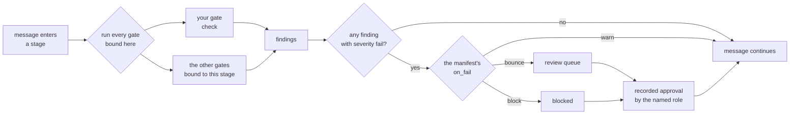

# My First Docketry Gate

A gate is one class with one method. It gets a message and answers one
question about it: does this stop, or does it keep going?

Everything Docketry enforces is a gate. The ethical wall is a gate. The
e-service notice parser is a gate. Nothing shipped here has a privilege your
gate does not have, and this page ends with you having written one.

Five minutes. You need Python 3.11+ and a Docketry home.

```console
$ pip install docketry
$ docketry init          # asks nine questions, writes the home
```

---

## 1. Write it (10 seconds)

```console
$ docketry new-gate long-subject
wrote docketry-home/gates/long_subject.py
```

That file is a gate that already works, with every part of itself explained
in comments. You are going to change a working thing, not assemble one.

## 2. Run it (10 seconds)

```console
$ docketry try-gate long-subject --subject "this subject is quite a lot longer than five words"
gate:    long-subject (file:gates/long_subject.py)
message: 'this subject is quite a lot longer than five words' from someone@example.com, 0 attachment(s)
result:  [fail] subject is 10 words, over the 5 this pipeline accepts: '...'
```

No mailbox, no pipeline, no store, nothing to clean up. `try-gate` builds one
message and hands it to your gate. This is the loop: change the file, run this,
read the finding.

A short subject passes:

```console
$ docketry try-gate long-subject --subject "short one"
result:  no findings — this message passes
```

## 3. Change it (3 minutes)

Open `docketry-home/gates/long_subject.py` and replace the body of `check()`.
Say you want to hold anything arriving as a `.zip`, because your firm's rule
is that court documents do not come zipped:

```python
    def check(self, envelope, options: dict) -> list[Finding]:
        held = []
        for attachment in envelope.attachments:
            if attachment.filename.lower().endswith(".zip"):
                held.append(Finding(
                    self.id,
                    SEVERITY_FAIL,
                    f"{attachment.filename} is a zip archive — this pipeline"
                    " takes documents, not archives",
                ))
        return held
```

Run it against a message that has one:

```console
$ docketry try-gate long-subject --attach "discovery.zip"
result:  [fail] discovery.zip is a zip archive — this pipeline takes documents, not archives
```

Write the summary for whoever reads the queue at five o'clock. It is the whole
explanation they get for why their message is sitting there.

## 4. Bind it (1 minute)

A gate that exists is not a gate that runs. Add this to `guardrails.toml` in
your home — `new-gate` printed it for you:

```toml
[[gate]]
id = "long-subject"
binds_to = ["ingest"]
on_fail = "bounce"
authority = "paralegal"
```

Confirm Docketry sees it:

```console
$ docketry gates
long-subject       file:gates/long_subject.py
                   Long subject.
name-screen        built-in
...
```

It now runs on every message that enters the `ingest` stage, and anything it
fails parks in the review queue until a paralegal releases it on the record.
That is the same treatment the shipped gates get. There is no other path.

---

## What you just plugged into



Note where your gate is not. It reports; it does not decide what happens next.
Whether a failed check means "warn and continue", "park in the queue" or "stop
dead" is the firm's manifest, and releasing a hold is a human approval recorded
in an audit log. A gate that could release its own hold would not be a
guardrail.

---

## Reference

### The protocol

```python
class MyGate:
    id: str                          # "my-gate" — lowercase, hyphenated
    allowed_stages: set[str] | None   # where it may be bound; None = anywhere

    def check(self, envelope, options: dict) -> list[Finding]: ...
    def validate_options(self, options: dict) -> list[str]: ...   # optional
```

`register(MyGate)` — or `@register` above the class — puts it in the registry
that manifests bind by id. Registering a duplicate id is refused: two gates
with one name means a manifest cannot say which it means, and quietly
replacing a shipped gate is how a guardrail stops guarding.

### What the envelope carries

`message_id`, `from_addr`, `to`, `cc`, `subject`, `body_text`, `date`,
`source`, `fetched_at`, `raw_sha256`, and `attachments` — each with
`filename`, `content_type`, `size`, `sha256`, and `content`, the real bytes,
on every run including re-runs after an approval.

The envelope is normalized before any gate sees it. Whatever the sending
system did with encodings, HTML bodies or filename escaping is already dealt
with, so your gate reads text and bytes rather than MIME.

### Severity and on_fail

`SEVERITY_FAIL` is the only severity that can hold a message. `SEVERITY_WARN`
and `SEVERITY_INFO` are recorded against the message and it keeps moving —
useful for a gate that annotates rather than stops.

What a `fail` *does* is the manifest's `on_fail`: `warn`, `bounce` (park in
the review queue) or `block` (stop). The same gate can be advisory in one
firm's pipeline and blocking in another's without changing a line of its code.

### allowed_stages

Set it to the stages your gate is meant for and binding it elsewhere refuses
when the manifest loads — at install time, in front of whoever is configuring
it, rather than at five o'clock in front of someone who cannot fix it. `None`
means the gate is safe anywhere.

### Options and validating them

`[gate.options]` in the manifest arrives as the `options` dict. Implement
`validate_options()` and anything you return refuses the manifest at load
time with your message attached, which is the cheapest moment for a firm to
learn it made a typo.

### The rules a gate lives by

* **Deterministic.** Same message in, same findings out. A guardrail that
  answers differently on Tuesday is not a guardrail.
* **Read-only.** A gate never sends mail, writes to the store, or moves a
  message. It returns findings.
* **No model.** Gates decide; models propose, elsewhere, and a human approves.
  A test in this repo asserts no shipped gate imports the model client.
* **No network.** Docketry's promise is that nothing it reads leaves the
  machine. A gate that phones out breaks that promise on the firm's behalf.

The first three are conventions your gate can technically violate — you are
running your own Python on your own machine. They are the difference between
a gate a firm can rely on and one it cannot.

### Where gates come from

`docketry gates` labels every gate with its source:

| Label | Means |
|---|---|
| `built-in` | ships in the port, `docketry/core/gates/` |
| `built-in (tools)` | ships with Docketry but plugs in from `docketry/tools/`, exactly as yours does |
| `file:gates/x.py` | a `.py` file in your Docketry home's `gates/` directory |
| `package:name` | an installed package declaring a `docketry.gates` entry point |

Home gates are loaded from exactly one directory — `<home>/gates/` — and
nowhere else. It is arbitrary Python running with your permissions, the same
trust you already extend to `guardrails.toml`, which is why the source is
printed on every listing and by `docketry doctor`.

A file that raises, or that registers no gate, stops the command with the
filename and the error. It is never skipped quietly: a gate the operator
believes is running and is not is worse than no gate at all.

### Shipping it to other firms

When a gate outgrows one file, make it a package and declare an entry point:

```toml
# pyproject.toml
[project.entry-points."docketry.gates"]
conflict-check = "my_package.gates:ConflictCheck"
```

`pip install my-package` and it appears in `docketry gates` as
`package:conflict-check`. Same registry, same rules; the only difference is
that pip put it there. Point the entry point at the class, or at a module that
registers on import — both read naturally.

### Testing it

`try-gate` is for the write-run-read loop. For a test suite, call the gate
directly — there is nothing to mock:

```python
from docketry.core.envelope import parse_message
from my_gates.zip_screen import ZipScreen

def test_a_zip_is_held():
    envelope = parse_message(raw_bytes, source="test", fetched_at="now")
    findings = ZipScreen().check(envelope, {})
    assert [f.severity for f in findings] == ["fail"]
```

`try-gate --eml path/to/message.eml` runs your gate against a real saved
message, which is the fastest way to check it against the thing that actually
arrives from a court system.

---

## Ideas worth building

Docketry ships the general ones. These are the shapes firms ask for:

* **Conflict check against a real list** — the shipped `name-screen` reads
  terms from the manifest. A gate that reads your practice management
  system's party list instead is a small piece of code and a much better
  wall.
* **Deadline extraction for a court your state uses** — the notice parser
  covers Florida's portal and federal NEFs. Yours probably does something
  else.
* **Client-confidentiality screen** — hold anything mentioning a matter the
  recipient is walled off from, sourced from your own access rules.
* **Retention policy** — flag messages that should not be in intake at all.

If you build one, open an issue. The interesting question for this project is
not how many gates it ships; it is whether the primitive is good enough that
someone else's gate is indistinguishable from ours.
